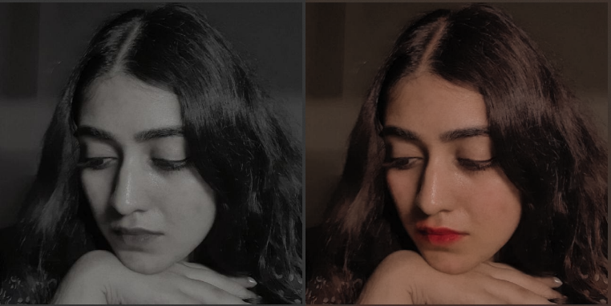

# Lumiere 


| Anime Style |
| ----------- | 
|  |

| Interactive Colorization |
|-------------------------|
|  |

| Grayscale Background |
 -------------------- |
|  |

| Super-Resolution |
| ---------------- |
|  |

| White Balance Correction |
| -------------------------|
|  |

| Instagram Filters | Bezier Curves and Selective Editing |
| ------------------| ------------------------------------|
| 
 |  |

| Spot Removal | Exposure Adjustment |
| -------------| --------------------|
|  |  |


Start the editor by running:

```console
foo:bar$ python src/main.py
```

## Features

### Basic Tools
* Zoom and Pan
* Color Picker
* Rectangle Select
* Path Select
* Crop
* Paint and Erase
* Exposure and Color Adjustment
* Histogram Viewer
* Curve Editor
* Spot Removal Tool
* Blur Tool
* Rotate Left/Right
* Horizontal/Vertical Stack
* Horizontal/Vertical Flip
* Panorama Image Stitching
* Instagram Filters

### AI Tools
* White Balance Correction
* Background Removal
* Human Segmentation
* Grayscale Background
* Portrait Mode Background Blur
* Interactive Colorization
* Super-Resolution
* Anime Style

## Example Results

| Before | After |
|--------|-------|
|  |  |
|  |  |
|  |  |
|  |  |
|  |  |
|  |  |
|  |  |
